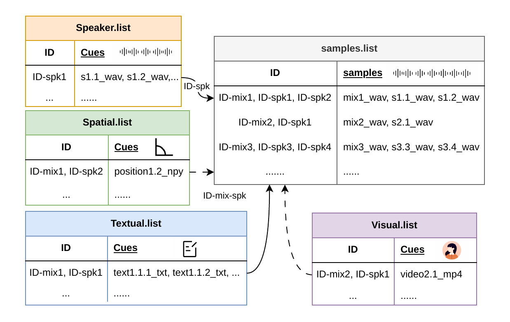
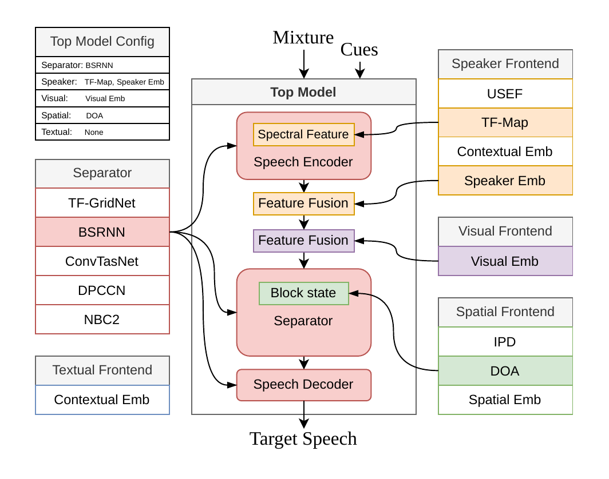
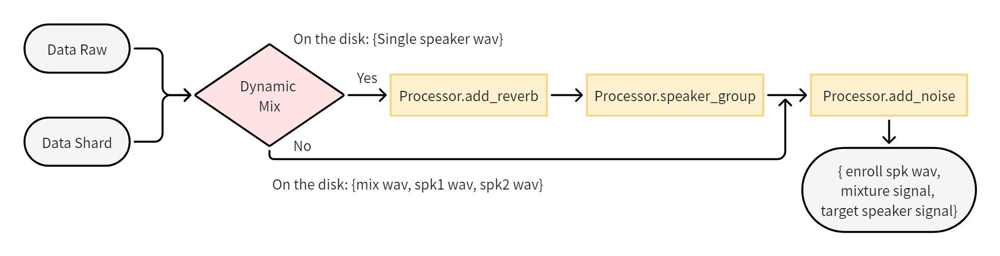

# WeSep

> Last updated: 2026-09-21

WeSep is a research toolkit for target speaker extraction (TSE) with speaker,
spatial, visual, and textual cues. It provides cue-aware data pipelines,
modular model interfaces, and reproducible recipes for academic research.

> [!IMPORTANT]
> WeSep v0.1 is a research preview. The current release focuses on data
> preparation and model training. Interfaces may still change, and production
> deployment is not yet supported.

Target speaker extraction isolates the speech of a specified target speaker
from an overlapped multi-talker recording.

## Current Scope

The v0.1 release supports the data preparation and training examples included
in this repository. The local-model CLI and official pretrained model packages
are under validation and will be released soon.

| Area | Status |
| --- | --- |
| Speaker-cued data preparation and training | Supported |
| Spatial-cued data preparation and training | Supported |
| Visual-cued data preparation and training | Supported |
| Textual-cued data preparation and training | Supported |
| Local-model CLI inference | Coming soon |
| Official pretrained models and automatic download | Coming soon |
| Python wheel and PyPI installation | Planned |
| ONNX, TorchScript, and C++ deployment | To be updated |

## Installation

The v0.1 research preview is intended to run from a source checkout. A tested
wheel/PyPI installation is not available yet.

```sh
git clone https://github.com/wenet-e2e/wesep.git
cd wesep

conda create -n wesep python=3.10
conda activate wesep
```

Install a matching PyTorch, TorchAudio, and TorchVision stack for your system
first. These packages are intentionally not listed in `requirements.txt`
because their versions and wheel index depend on the CUDA environment.

The current development server uses the following stack with CUDA 12.8:

```sh
pip install torch==2.7.1 torchaudio==2.7.1 torchvision==0.22.1 \
  --index-url https://download.pytorch.org/whl/cu128
```

Use the same package versions with the CUDA 11.8 wheel index on systems such
as NVIDIA V100:

```sh
pip install torch==2.7.1 torchaudio==2.7.1 torchvision==0.22.1 \
  --index-url https://download.pytorch.org/whl/cu118
```

Then install the WeSep dependencies. The speaker-cue models also require
WeSpeaker, which is installed from its official repository:

```sh
pip install -r requirements.txt
pip install git+https://github.com/wenet-e2e/wespeaker.git
```

Keep all three PyTorch packages on the matching release line. Recipe-specific
external dependencies are installed only when needed:
WeSpeaker for the speaker-encoder frontends, `gpuRIR` for spatial data
simulation. ONNX Runtime for DNSMOS scoring, together with the textual and
raw-video Python dependencies, is included in `requirements.txt`.
The included `onnxruntime` package uses CPU execution. To run DNSMOS with
`--dnsmos_use_gpu true`, replace it with an `onnxruntime-gpu` build compatible
with the local CUDA and cuDNN environment.

The code-quality tools are included in `requirements.txt`. Enable the Git hooks
for development with:

```sh
pre-commit install
```

## Quick Start

The speaker-cued LibriMix recipe is the recommended starting point. Run it
from its own directory and select stages explicitly.

Prepare the dataset indexes, enrollment cues, and configured speaker encoder:

```sh
cd examples/audio/librimix
./run.sh --stage 1 --stop_stage 1 \
  --Libri2Mix_dir /path/to/LibriMix
```

Start training after inspecting the generated files and configuration:

```sh
./run.sh --stage 3 --stop_stage 3 \
  --Libri2Mix_dir /path/to/LibriMix \
  --config confs/tse_bsrnn_spk.yaml
```

See the [LibriMix speaker-cue recipe](examples/audio/librimix/README.md) for
the expected dataset layout and stage behavior.

## Roadmap

### Data and training

- [x] Speaker-cued TSE recipes
- [x] Spatial-cued TSE recipes
- [x] Visual-cued TSE recipes
- [x] Textual-cued TSE recipes
- [x] Raw and shard data pipelines
- [x] Offline mixture preparation
- [x] Online mixture simulation
- [x] Dynamic reverberation and noise augmentation

### Models and inference

- [x] Time-domain and frequency-domain TSE model interfaces
- [x] Speaker, spatial, visual, and textual cue frontends
- [ ] Complete recipe-based inference and scoring validation
- [ ] Release the validated local-model CLI (coming soon)
- [ ] Release official pretrained models and automatic download (coming soon)

### Packaging and deployment

- [ ] Tested wheel and PyPI installation
- [ ] Stable public Python API
- [ ] ONNX export and inference
- [ ] Updated TorchScript export
- [ ] Updated C++ runtime

The existing C++ runtime targets a legacy model interface and is retained for
reference only. It is not supported by the current v0.1 model interface.

## Recipes

The recipes follow a staged workflow for data preparation, optional shard
creation, training, checkpoint averaging, inference, and scoring.

| Cue | Dataset and recipe | Example models |
| --- | --- | --- |
| Speaker | [LibriMix](examples/audio/librimix/README.md) | BSRNN, SpEx+, DPCCN, TFGridNet |
| Speaker | [VoxCeleb1 online mixing](examples/audio/voxceleb1/README.md) | BSRNN |
| Speaker, multichannel mixture | [MC-LibriMix](examples/audio/mc_librimix/README.md) | BSRNN |
| Spatial | [MC-LibriMix](examples/spatial/mc_librimix/README.md) | BSRNN, NBC2 |
| Speaker + spatial | [MC-LibriMix](examples/audio_spatial/mc_librimix/README.md) | BSRNN |
| Visual | [VoxCeleb2Mix](examples/visual/voxceleb2mix/README.md) | BSRNN, TFGridNet |
| Textual | [LibriMix keywords](examples/textual/librimix_keywords/README.md) | BSRNN + KCE |

Run each recipe from its own directory. Refer to its README for datasets,
external resources, configuration choices, and complete commands.

## Framework

The current WeSep design is described in
[WeSep: A Modular and Cue-Composable Framework for Target Speaker
Extraction](https://arxiv.org/abs/2607.27436). It treats TSE as heterogeneous
cue-conditioned learning and decouples data organization, cue frontends,
separator backbones, and top-level composition.

### Heterogeneous Data Organization

Each training instance is defined as a mixture-target pair in `samples.jsonl`.
Speaker, spatial, visual, and textual cues are maintained in modality-specific
repositories and retrieved by speaker, mixture, or composite identifiers.



### Modular Top Model

A configuration instantiates the separator and cue frontends. Different cue
features can be injected at the spectral, fusion, or separator-state level
without redesigning the complete model.



## Data Pipeline

Following WeNet and WeSpeaker, WeSep organizes data processing as a pipeline of
composable processors. The pipeline supports raw and shard data, target-level
cue lookup, online mixing, augmentation, and speaker-expanded collation.



## Documentation

The English documents are the primary maintained versions. Chinese mirrors are
provided alongside them and carry the same update date.

- Data pipeline contract: [English](docs/data_pipeline.md) |
  [中文](docs/data_pipeline.zh-CN.md)
- Cue and collate contract: [English](docs/cue_collate_design.md) |
  [中文](docs/cue_collate_design.zh-CN.md)
- Model training interface: [English](docs/model_training_interface.md) |
  [中文](docs/model_training_interface.zh-CN.md)
- Release roadmap: [English](docs/release_roadmap.md) |
  [中文](docs/release_roadmap.zh-CN.md)

## CLI and Pretrained Models

Local-model CLI inference, official pretrained model packages, and automatic
model download are currently under validation and will be released soon.

## Discussion

For Chinese users, scan the QR code on the left to join the WeChat group. If
it has expired, use the personal WeChat QR code on the right.

|  |  |
| --- | --- |

## Citation

If you find WeSep useful, please cite the latest framework paper:

```bibtex
@misc{zhang2026wesep,
  title         = {WeSep: A Modular and Cue-Composable Framework for Target Speaker Extraction},
  author        = {Ke Zhang and Xiaoyang Yu and Haoyu Li and Shuai Wang and Shuhan Zhang and Haizhou Li},
  year          = {2026},
  eprint        = {2607.27436},
  archivePrefix = {arXiv},
  primaryClass  = {eess.AS},
  url           = {https://arxiv.org/abs/2607.27436},
}
```

The earlier WeSep toolkit paper corresponds to the legacy implementation and
recipes preserved under [`wesep_deprecated`](wesep_deprecated) and
[`examples_deprecated`](examples_deprecated). These directories are no longer
maintained and may be removed in a future release. Cite the following paper
when using or comparing against that legacy version:

```bibtex
@inproceedings{wang24fa_interspeech,
  title     = {{WeSep: A Scalable and Flexible Toolkit Towards Generalizable Target Speaker Extraction}},
  author    = {Shuai Wang and Ke Zhang and Shaoxiong Lin and Junjie Li and Xuefei Wang and Meng Ge and Jianwei Yu and Yanmin Qian and Haizhou Li},
  year      = {2024},
  booktitle = {{Interspeech 2024}},
  pages     = {4273--4277},
  doi       = {10.21437/Interspeech.2024-1840},
}
```

## License

WeSep is released under the [Apache License 2.0](LICENSE), except for the
third-party components listed in [THIRD_PARTY_NOTICES.md](THIRD_PARTY_NOTICES.md).
